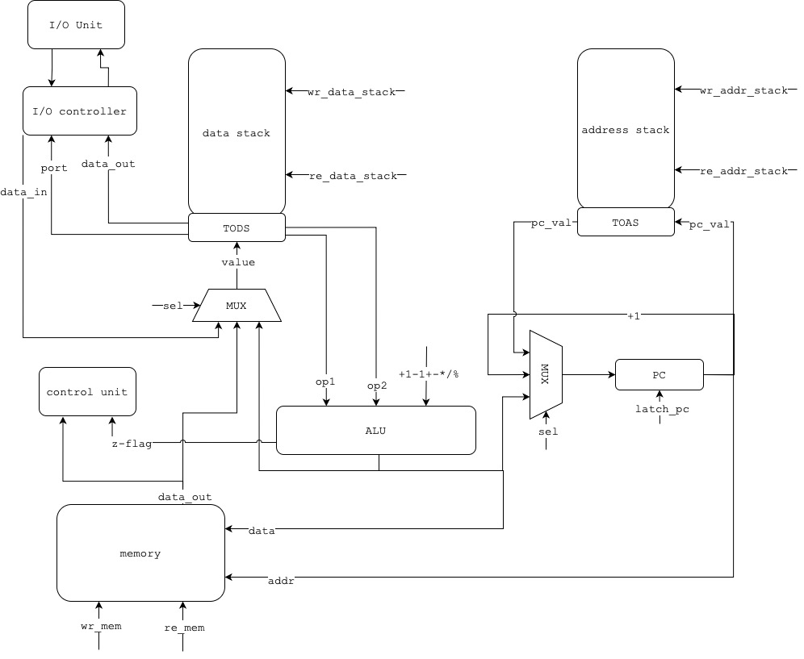
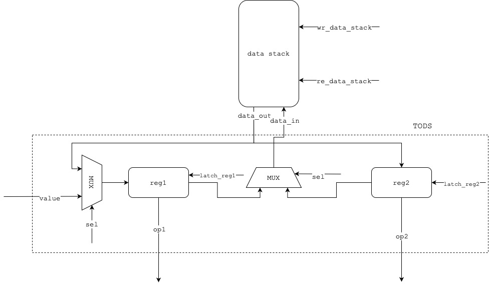
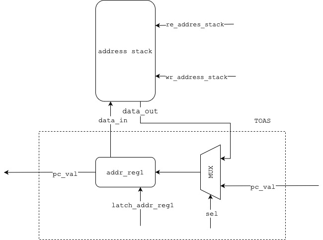
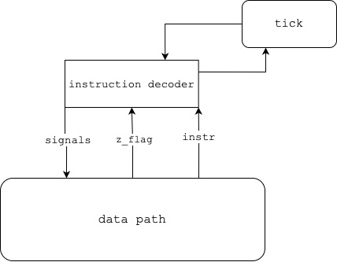

# Basic Stack Machine

- Глотов Егор Дмитриевич, P3232
- `alg -> asm | stack | neum | hw | tick -> instr | struct | stream | port | pstr | prob2 | cache`
- Упрощенный вариант -- `asm | stack | neum | hw | instr | struct | stream | port | pstr | prob2 | -`

## [Язык программирования](#язык-программирования)

Синтаксис расширенной `BNF`

- `[ ... ]` -- вхождение `0` или `1` раз
- `{ ... }` -- вхождение `0` или несколько раз
- `{ ... }-` -- вхождение `1` или несколько раз

``` ebnf
program ::= section_data "\n" section_text

section_text ::= "section .text:" [comment] "\n" {command_section}

section_data ::= "section .data:" [comment] "\n" {data}

data ::= var [comment]

var ::= variable_name ":" var_value
 
var_value ::= number
             | string
             | variable_name

command_section ::= label [comment] | command 

command ::= op0 [comment] | op1 [comment]

label ::= label_name ":\n\t"

op0 ::= add 
        | sub
        | mul
        | div
        | mod
        | halt
        | dup
        | switch
        | drop
        | push
        | pop
        | inc
        | dec
        | ret
        | cmp

op1 ::= call label
        | in positive_number
        | out positive_number 
        | lit var_name
        | lit number
        | jmp label
        | jz label
        | jnz label
        

lowercase_letter ::= [A-Z]
uppercase_letter ::= [a-z]

digit ::= [0-9]
positive_number ::= <any digit except: 0> {digit}
negative_number ::= ["-"] positive_number
number ::= positibe_number | negative_number 
string = "\"[><\w\s,.:;!?()\\-]+\""
label_name ::= lowercase_letter | uppercase_letter {lowercase_letter} | {uppercase_letter} | {number}
var_name ::= label_name
comment ::= ";" {<any symbol except "\n">}
```

Поддерживаются однострочные комментарии, начинающиеся с `;`

Операции:

- `add` -- Сложение двух значений на верхушке стека, результат кладется на верхушку стека данных `[a, b] -> [b + a]`
- `sub` -- Разность двух значений на верхушке стека, результат кладется на верхушку стека данных `[a, b] -> [b - a]`
- `mul` -- Произведение двух значений на верхушке стека, результат кладется на верхушку стека данных `[a, b] -> [b * a]`
- `div` -- Целочисленное деление двух значений с верхушки стека, результат кладется на верхушку стека данных `[a, b] -> [b / a]`
- `mod` -- Остаток от деления двух значений с верхушки стека, результат кладется на верхушку стека данных `[a, b] -> [b % a]`
- `cmp` -- Сравнение двух значений с верхушки стека данных, установка `z_flag` по результату сравнения `[a, b] -> [a, b], z_flag`
- `inc` -- Увеличение на единицу значения, лежащее на верхушке стека данных `[a] -> [a + 1]`
- `dec` -- Уменьшение на единицу значения, лежащее на верхушке стека данных `[a] -> [a - 1]`
- `dup` -- Дублирование значения, лежащее на верхушке стека данных `[a] -> [a, a]`
- `switch` -- Поменять местами два верхних значения на стеке данных `[a, b] -> [b, a]`
- `drop` -- Удалить значение с верхушки стека данных
- `push` -- Поместить вместо значения, лежащего на верхушке стека данных, значение взятое из памяти по адресу из верхушки стека данных
- `pop` -- Взять адрес с верхушки стека данных и записать в память следующее значение со стека данных по взятому адресу
- `in port` -- Прочитать символ на вершину стека данных согласно указанному порту
- `out port` -- Записать значение с вершины стека данных по указанному порту
- `call label` -- Вызов подпрограммы по указанной метке
- `ret` -- Возврат из подпрограммы
- `lit var_name` -- Загрузка на верхушку стека данных адрес указанной переменной
- `lit number` -- Загрузка указанного числа на верхушку стека данных
- `jmp label` -- Безусловный переход на адрес указанной метки
- `jz label` -- Условный переход на адрес указанной метки (если `z_flag` == 0)
- `jnz label` -- Условный переход на адрес указанной (если `z_flag` != 0)
- `halt` -- Останов программы

Метки для переходов определяются на отдельных строчках:

```asm
label:
  lit 32
  lit 42
  add
  halt
```

И в другом месте мы можем сослаться на эту метку (неважно метка будет определена до или после того места, откуда мы
будем ссылаться)

```asm
jmp label ; jmp 12, где 12 - адрес инструкции после объявления метки
```

Транслятор поставит вместо названия метки адрес инструкции после определения метки

В программе не может быть дубликатов меток, а также переменных с одинаковым названием

Метки чувствительны к регистру. `StOp` и `stop` считаются за разные метки

Любая программа обязан иметь строчки `section .data` и `section .text`, даже если они пустые

- Выделение памяти происходит статически, при запуске модели
- Видимость данных -- глобальная
- Поддерживается два типа литералов: число, символ или набор символов
- Типизация -- бестиповая

Пример программы на созданном языке

```asm
  section .data:
      x: 2
      y: 2
  section .text:
      lit x
      push
      lit y
      push
      add
      halt
```

## [Организация памяти](#организация-памяти)

Модель памяти процессора:

- Память соответствует архитектуре фон Неймана -- общая память для команд и данных
- Адресация -- абсолютная
- Размер машинного слова не определен -- представляет собой структуру данных. Операнд -- 32-битный, интерпретируется как
  знаковое целое число

```text
      Memory model
+--------------------------+
|00 : program start address|
|01 : data                 |  
|02 : ...                  |
|  ...                     |
|k  : program start        |  
|k+1: instructions         |
|  ...                     |
+--------------------------+
```

- Первая ячейка памяти с адресом 00 -- служебная. В ней хранится адрес начала инструкций
- Со второй ячейки памяти, начиная с адреса 01, начинается секция `.data`.

- Все переменные указанные в секции `.data` в том же порядке отображаются в память
- С `k` ячейки памяти начинаются инструкции, прописанные программистом в секции `.text`
- Программисту доступна вся память, а также стек данных

Модель стека данных и стека адреса (более подробно стек данных и стек адреса нарисован в
пункте [Модель процессора](#модель-процессора))

```textmate
+----------------+ 
|                |
|                |    
|   Data stack   |
|                |
|                |
|                |
+----------------+
|      TODS      |
+----------------+

+----------------+
|                |
|                |    
|  Address stack |
|                |
|                |
|                |
+----------------+
|      TOAS      |
+----------------+
```

- Стек 32-разрядный и позволяет помещать один операнд одной команды

## [Система команд](#система-команд)

Особенности процессора:

- Переменные в секции `.data` могут быть следующими типами:
    - `Строковые` -- каждый символ переводится в числовое представление согласно таблице `Unicode`. Под строку
      отводится `n + 1` ячейка памяти, где первая ячейка -- это длина строка, последующие ячейки -- символы. Один
      символ -- одна ячейка памяти
    - `Целочисленные` -- под каждое значение отводится одна ячейка памяти
    - `Буферные` -- в памяти резервируется `n` последовательных ячеек, заполненных нулями
    - `Ссылочные` -- хранят адрес другой переменной, отводится одна ячейка памяти
- Размер машинного слова не определен -- представляет собой структуру данных. Операнд -- 32-битный, интерпретируется как
  знаковое целое число
- Память общая для данных и команд. Доступ к памяти осуществляется по адресу, хранящемуся в
  регистре `PC (program counter)`. Значение в регистре `PC` может устанавливаться тремя способами:
    - Запись значения с верхушки стека данных
    - Запись значения с верхушки стека адресов
    - Инкремент предыдущего значения, находящегося в `PC`
- Ввод-вывод осуществляется как поток токенов. Есть контроллер ввода-вывода, к которому можно обращаться по порту и
  записывать или читать значения с внешнего устройства. Значения с внешнего устройства читаются на вершину стека данных,
  записываются с вершины стека данных во внешнее устройство
- Система прерываний отсутствует
- Поток управления:
    - Поддерживается безусловный переход `jmp` и условные переходы `jz` и `jnz`
    - Если инструкция не касается переходов, то значение `PC` увеличивается на `1`

### Набор инструкций

Все операции однозначно транслируются в инструкции

| Мнемоника |       Синтаксис       | Количество тактов | Описание                                                                                                                        |
|:---------:|:---------------------:|:-----------------:|:--------------------------------------------------------------------------------------------------------------------------------|
|   `add`   |         `add`         |         4         | Сумма двух значений с верхушки стека данных                                                                                     |
|   `sub`   |         `sub`         |         4         | Разность двух значений с верхушки стека данных                                                                                  |
|   `mul`   |         `mul`         |         4         | Произведение двух значений с верхушки стека данных                                                                              |
|   `div`   |         `div`         |         4         | Целочисленное деление двух значений с верхушки стека данных                                                                     |
|   `mod`   |         `mod`         |         4         | Остаток от деления двух значений с верхушки стека данных                                                                        |
|   `cmp`   |         `cmp`         |         4         | Сравнение двух значений с верхушки стека данных (выполнение команды `sub`), установка `z_flag = 0`  в случае равенства значений |
|   `inc`   |         `inc`         |         3         | Инкремент значения, лежащего на верхушке стека данных                                                                           |
|   `dec`   |         `dec`         |         3         | Уменьшение значения, лежащее на вершине стека данных, на единицу                                                                |
|   `dup`   |         `dup`         |         3         | Дублирование значения, лежащее на вершине стека данных                                                                          |
| `switch`  |       `switch`        |         4         | Поменять местами два верхних значения на стеке данных                                                                           |
|  `drop`   |        `drop`         |         1         | Удалить значения с вершины стека данных                                                                                         |
|  `push`   |        `push`         |         5         | Поместить вместо значения, лежащего на верхушке стека данных, значение взятое из памяти по адресу из верхушки стека данных      |
|   `pop`   |         `pop`         |         5         | Взять адрес с верхушки стека данных и записать в память следующее значение со стека данных по взятому адресу                    |
|   `in`    |        `in 0`         |         3         | Прочитать символ на вершину стека данных согласно указанному порту                                                              |
|   `out`   |        `out 1`        |         3         | Записать значение с вершины стека данных по указанному порту                                                                    |
|  `call`   |      `call loop`      |         4         | Вызов подпрограммы по указанной метке                                                                                           |
|   `ret`   |         `ret`         |         2         | Возврат из подпрограммы                                                                                                         |
|   `lit`   | `lit 1` или `lit var` |         2         | Загрузка на вершину стека числа или непосредственно адреса указанной переменной                                                 |
|   `jmp`   |   `jmp label_name`    |         2         | Безусловный переход по адресу метки                                                                                             |
|   `jz`    |    `jz label_name`    |      1 или 2      | Условный переход по указанной метке (если `z_flag == 0`)                                                                        |
|   `jnz`   |   `jnz label_name`    |      1 или 2      | Условный переход по указанной метке (если `z_flag != 0`)                                                                        |
|  `halt`   |        `halt`         |         0         | Останов программы                                                                                                               |

Приведенные такты относятся только к циклу исполнения инструкции. Цикл декодирования занимает 1 такт процессора

### Способ кодирования инструкций

- Машинный код сериализуется в список `JSON`
- Один элемент списка -- одна ячейка памяти
- Индекс списка -- адрес инструкции в памяти

Пример машинного слова:

```json
[
  {
    "opcode": "lit",
    "addr": 87,
    "arg": 77
  }
]
```

Пояснение полей:

- `opcode` - код операции
- `addr` - адрес инструкции
- `arg` - аргумент инструкции (может отсутствовать)

## [Транслятор](#транслятор)

Интерфейс командной строки: `python3 translator.py <input_file> <target_file>`

Реализовано в модуле [translator](translator.py)

Этапы трансляции:

- Чтение исходного кода, имя которого указано в аргументах командной строки
- Очистка кода от комментариев, пустых строк и лишних пробелов (функция [clean_source](translator.py))
- Выделение переменных и формирование секции данных, которая будет находиться в памяти. Все переменные записываются в
  словарь, который позже будет использован для разрешения адресов как в секции данных, так и в секции инструкций. Также
  происходит синтаксический анализ кода, при возникновении ошибки транслятор будет остановлен и будет выведена ошибка (функция [translate_section_data](translator.py))
- Выделение инструкций, меток, трансляция секции `.text`. Все метки добавляются в словарь, позже этот словарь будет
  использован для разрешения адресов переходов и вызовов подпрограмм (функция [translate_section_text](translator.py))
- Расчет и подстановка в секции данных вместо ссылочных переменных адреса, расчет и подстановка адресов вместо меток и
  переменных в секции `.text`. Происходит проверка существования переменных и меток, на которые ссылается программист. В
  случае ошибки транслятор будет остановлен (функция [resolve_addresses](translator.py))
- Сериализация странслированного исходного кода в `JSON` и запись машинного кода в файл, указанный в аргументах
  командной строки. Для сериализации данных в `JSON` используется функция, которая говорит как нужно сериализовать
  объекты (функция [custom_serializer](translator.py))

Правила генерации машинного кода:

- Одна переменная или инструкция -- одна строка
- Первая ячейка памяти отведена для адреса начала инструкций
- Для команд, однозначно соответсвующих инструкциям, -- прямое отображение
- Названия секций и меток пишутся в отдельных строках
- Ссылаться можно только на существующие переменные и/или метки

В результате трансляции генерируется файл с именем, указанными при запуске транслятора, с машинными кодом

## [Модель процессора](#модель-процессора)

Интерфейс командной строки: `python3 machine.py <machine_code_file> <input_file> <log_level> - optional`

Последний аргумент позволяет выбрать просмотр уровня журнала состояния процессора. Является опциональным. По умолчанию
уровень вывода журнала состояния процессора -- `DEBUG`

Реализовано в модуле [machine](machine.py)

### Схема DataPath



Реализован в классе [DataPath](machine.py)

### Стек данных



- `reg1` и `reg2` - регистры, в которых можно хранить значения с верхушки стека данных. Используются для ввода/вывод
  данных из стека

### Стек адреса



`addr_reg1` - регистр для хранения значения с верхушки стека данных. Используется для ввода/вывода значений со стека
адресов

Сигналы (обрабатываются за один такт, реализованы в виде методов класса):

- `wr_data_stack` -- записать значение из регистра `reg1` или `reg2` на верхушку стека данных
- `re_data_stack` -- прочитать значение с верхушки стека данных в `reg1` и/или в `reg2`
- `latch_reg1` -- защелкнуть значение в регистр `reg1`
  - значение, пришедшее из памяти
  - значение, пришедшее ищ `alu`
  - с порта ввода (обработка на Python)
    - извлечь из входного буфера значение и записать в `reg1`
    - если буфер пусть -- выбросить исключение
- `latch_reg2` -- защелкнуть значение в регистр `reg2`
  - значение с вершины стека данных
- `wr_addr_stack` -- записать значение из регистра `addr_reg1` на верхушку стека адреса
- `re_addres_stack` -- прочитать значение с верхушки стека данных в регистр `addr_reg1`
- `latch_addr_reg1` -- защелкнуть значение в регистр `addr_reg`
  - значение с верхушки стека адреса
  - значение, пришедшее из `PC`
- `wr_mem` -- прочитать значение из памяти по пришедшему адресу
- `re_mem` -- записать значение по пришедшему адресу
- `latch_pc` -- защелкнуть значение в регистр `PC`
  - инкрементированное
  - значение с вершины стека адреса
  - значение с вершины стека данных
- `+1` -- выполнить операцию инкремента
- `-1` -- выполнить операцию декремента
- `-` -- выполнить операцию вычитания
- `+` -- выполнить операцию сложения
- `*` -- выполнить операцию умножения
- `/` -- выполнить операцию целочисленного деления
- `%` -- выполнить операцию взятия остатка от деления

Флаги:

- `z_flag` - отражает наличие нулевого результат операции, выполненной в `alu`

### ControlUnit



Реализован в классе [ControlUnit](machine.py)

- `Hardwired` (реализован полностью на Python)
- Метод `init_cycle` выполняет предварительную инициализацию модели, а именно защелкивание в `PC` адрес начала
  инструкций (2 такта процессора)
- Метод `decode_and_execute_instruction` декодирует и выполняет инструкцию (1 такт процессора)
- `tick` -- подсчет тактов процессора

Особенности работы модели:

- Цикл симуляции осуществляется в функции `sumilation`.
- Шаг моделирования соответствует одной инструкции с выводом состояния в журнал
- Для журнала состояния процессора используется стандартный модуль `logging`
- Количество инструкций для моделирования лимитировано (`3000`)
- Остановка моделирования происходит при:
    - превышения лимита инструкций
    - возникновения исключения `HaltProgramError` -- если выполнена инструкции  `halt`

## [Тестирование](#тестирование)

Тестирование осуществляется при помощи golden test-ов

- Тесты реализованы в: [golden_test.py](golden_test.py)
- Конфигурация тестов лежит в папке [golden](golden)

Запустить тесты: `poetry run pytest . -v`

Обновить конфигурацию golden test-ов: `poetry run pytest . -v --update-goldens`

CI при помощи Github Actions:

```yaml
name: Python CI

on:
  push:
    branches: [ main ]

jobs:
  lint:
    runs-on: ubuntu-latest

    steps:
      - name: Checkout code
        uses: actions/checkout@v4

      - name: Install Python
        uses: actions/setup-python@v5
        with:
          python-version: 3.12.3

      - name: Install dependencies
        run: |
          python3 -m pip install --upgrade pip
          pip3 install poetry
          poetry install

      - name: Code formatting Ruff test
        run: poetry run ruff format --check .

      - name: Ruff linters run
        run: poetry run ruff check .

  test:
    runs-on: ubuntu-latest

    steps:
      - name: Checkout code
        uses: actions/checkout@v4

      - name: Install Python
        uses: actions/setup-python@v5
        with:
          python-version: 3.12.3

      - name: Install dependencies
        run: |
          python3 -m pip install --upgrade pip
          pip3 install poetry
          poetry install

      - name: Run tests and get coverage
        run: |
          poetry run pytest . -v
          poetry run coverage run -m pytest
          poetry run coverage report -m
        env:
          CI: true
```

Где:

- `poetry` -- управления зависимостями для языка программирования Python
- `coverage` -- формирование отчет об уровне покрытия исходного кода
- `pytest` -- утилита для запуска тестов
- `ruff` -- утилита для форматирования и проверки стиля кодирования

Пример использования и журнал работы процессора на примере `test_add`:

```shell
ilestegor@ilestegor lab3 % cat examples/add.txt 
section .data:
      x: 2
      y: 2
section .text:
      lit x
      push
      lit y
      push
      add
      halt
ilestegor@ilestegor lab3 % python3 translator.py examples/add.txt out.txt 
source LoC: 10 code instr: 6
ilestegor@ilestegor lab3 % cat out.txt 
[
 {
  "addr": 0,
  "value": 3
 },
 {
  "addr": 1,
  "value": 2
 },
 {
  "addr": 2,
  "value": 2
 },
 {
  "opcode": "lit",
  "addr": 3,
  "arg": 1
 },
 {
  "opcode": "push",
  "addr": 4
 },
 {
  "opcode": "lit",
  "addr": 5,
  "arg": 2
 },
 {
  "opcode": "push",
  "addr": 6
 },
 {
  "opcode": "add",
  "addr": 7
 },
 {
  "opcode": "halt",
  "addr": 8
 }
]
ilestegor@ilestegor lab3 % python3 machine.py out.txt input 
DEBUG: execute_lit: TICK: 5   PC 4   TODS1 1   TODS2 0   TOAS 0   Z_FLAG 0   lit 1
       DATA_STACK [1]
       ADDRESS_STACK [] 

DEBUG: execute_push: TICK: 11  PC 5   TODS1 2   TODS2 0   TOAS 4   Z_FLAG 0   push
       DATA_STACK [2]
       ADDRESS_STACK [] 

DEBUG: execute_lit: TICK: 14  PC 6   TODS1 2   TODS2 0   TOAS 4   Z_FLAG 0   lit 2
       DATA_STACK [2, 2]
       ADDRESS_STACK [] 

DEBUG: execute_push: TICK: 20  PC 7   TODS1 2   TODS2 0   TOAS 6   Z_FLAG 0   push
       DATA_STACK [2, 2]
       ADDRESS_STACK [] 

DEBUG: execute_binary_alu_operation: TICK: 25  PC 8   TODS1 4   TODS2 2   TOAS 6   Z_FLAG 1   add
       DATA_STACK [4]
       ADDRESS_STACK [] 

DEBUG: execute_halt: TICK: 26  PC 8   TODS1 4   TODS2 2   TOAS 6   Z_FLAG 1   halt
       DATA_STACK [4]
       ADDRESS_STACK [] 

instruction_count: 6, ticks: 26         
```

Пример проверки исходного кода:

```shell
ilestegor@ilestegor lab3 % poetry run pytest . -v
================================================== test session starts ===================================================
platform darwin -- Python 3.10.2, pytest-8.2.1, pluggy-1.5.0 -- /usr/local/bin/python3.10
cachedir: .pytest_cache
rootdir: /Users/ilestegor/Desktop/Универ/2курс/4сем/арх.комп/lab3
configfile: pyproject.toml
plugins: golden-0.2.2
collected 5 items                                                                                                        

golden_test.py::test_translator_and_machine[golden/test_hello_user_name.yml] PASSED                                [ 20%]
golden_test.py::test_translator_and_machine[golden/test_cat.yml] PASSED                                            [ 40%]
golden_test.py::test_translator_and_machine[golden/test_hello_world.yml] PASSED                                    [ 60%]
golden_test.py::test_translator_and_machine[golden/test_prob2.yml] PASSED                                          [ 80%]
golden_test.py::test_translator_and_machine[golden/test_add.yml] PASSED                                            [100%]

=================================================== 5 passed in 0.45s ====================================================

ilestegor@ilestegor lab3 % poetry run ruff check .
All checks passed!
ilestegor@ilestegor lab3 % poetry run ruff format . --check
6 files already formatted
ilestegor@ilestegor lab3 % poetry run ruff format .        
6 files left unchanged
```

```text
| ФИО                    | алг               | LoC |  code инстр. | инстр. | такт. | вариант                                                                     |
| Глотов Егор Дмитриевич | add               | 10  |  9           | 6      | 26    | asm | stack | neum | hw | instr | struct | stream | port | pstr | prob2 | - |
| Глотов Егор Дмитриевич | cat               | 28  |  23          | 270    | 1046  | asm | stack | neum | hw | instr | struct | stream | port | pstr | prob2 | - |
| Глотов Егор Дмитриевич | hello_user_name   | 162 |  194         | 1145   | 4602  | asm | stack | neum | hw | instr | struct | stream | port | pstr | prob2 | - |
| Глотов Егор Дмитриевич | hello_world       | 41  |  49          | 345    | 1406  | asm | stack | neum | hw | instr | struct | stream | port | pstr | prob2 | - |
| Глотов Егор Дмитриевич | prob2             | 56  |  48          | 1060   | 4314  | asm | stack | neum | hw | instr | struct | stream | port | pstr | prob2 | - |
```
