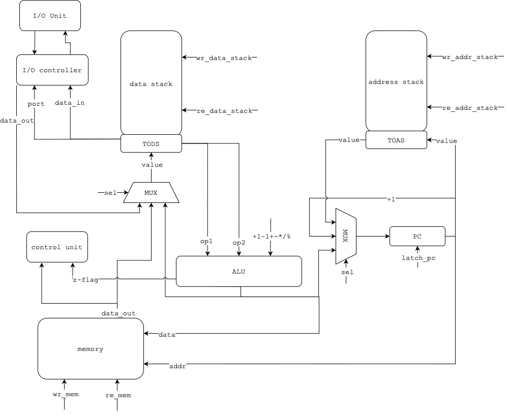

# Basic Stack Machine

- Глотов Егор Дмитриевич, P3232
- `alg -> asm | stack | neum | hw | tick -> instr | struct | stream | port | pstr | prob2 | cache`
- Упрощенный вариант - `asm | stack | neum | hw | instr | struct | stream | port | pstr | prob2 | -`

## [Язык программирования](#язык-программирования)

Синтаксис расширенной `BNF`

- `[ ... ]` -- вхождение `0` или `1` раз
- `{ ... }` -- вхождение `0` или несколько раз
- `{ ... }-` -- вхождение `1` или несколько раз

``` ebnf
program ::= section_data "\n" section_text

section_text ::= "section .text:" [comment] "\n" {command_section}

section_data ::= "section .data:" [comment] "\n" {data}

data ::= var [comment]

var ::= variable_name ":" var_value
 
var_value ::= number
             | string
             | variable_name

command_section ::= label [comment] | command 

command ::= op0 [comment] | op1 [comment]

label ::= label_name ":\n\t"

op0 ::= add 
        | sub
        | mul
        | div
        | mod
        | halt
        | dup
        | switch
        | drop
        | push
        | pop
        | inc
        | dec
        | ret
        | cmp

op1 ::= call label
        | in positive_number
        | out positive_number 
        | lit var_name
        | lit number
        | jmp label
        | jz label
        | jnz label
        

lowercase_letter ::= [A-Z]
uppercase_letter ::= [a-z]

digit ::= [0-9]
positive_number ::= <any digit except: 0> {digit}
negative_number ::= ["-"] positive_number
number ::= positibe_number | negative_number 
string = "\"[><\w\s,.:;!?()\\-]+\""
label_name ::= lowercase_letter | uppercase_letter {lowercase_letter} | {uppercase_letter} | {number}
var_name ::= lowercase_letter | uppercase_letter {lowercase_letter} | {uppercase_letter} | {number}
comment ::= ";" {<any symbol except "\n">}
```

Поддерживаются однострочные комментарии, начинающиеся с `;`

Операции:

|    Операция    | Описание                                                                                                                   |
|:--------------:|:---------------------------------------------------------------------------------------------------------------------------|
|     `add`      | Сложение двух значений на верхушке стека, результат кладется на верхушку стека данных `[a, b] -> [b + a]`                  |
|     `sub`      | Разность двух значений на верхушке стека, результат кладется на верхушку стека данных `[a, b] -> [b - a]`                  |
|     `mul`      | Произведение двух значений на верхушке стека, результат кладется на верхушку стека данных `[a, b] -> [b * a]`              |
|     `div`      | Целочисленное деление двух значений с верхушки стека, результат кладется на верхушку стека данных `[a, b] -> [b / a]`      |
|     `mod`      | Остаток от деления двух значений с верхушки стека, результат кладется на верхушку стека данных `[a, b] -> [b % a]`         |
|     `cmp`      | Сравнение двух значений с верхушки стека данных, установка `z_flag` по результату сравнения `[a, b] -> [a, b], z_flag`     |
|     `inc`      | Увеличение на единицу значения, лежащее на верхушке стека данных `[a] -> [a + 1]`                                          |
|     `dec`      | Уменьшение на единицу значения, лежащее на верхушке стека данных `[a] -> [a - 1]`                                          |
|     `dup`      | Дублирование значения, лежащее на верхушке стека данных `[a] -> [a, a]`                                                    |
|    `switch`    | Поменять местами два верхних значения на стеке данных `[a, b] -> [b, a]`                                                   |
|     `drop`     | Удалить значение с верхушки стека данных                                                                                   |
|     `push`     | Поместить вместо значения, лежащего на верхушке стека данных, значение взятое из памяти по адресу из верхушки стека данных |
|     `pop`      | Взять адрес с верхушки стека данных и записать в память следующее значение со стека данных по взятому адресу               |
|   `in port`    | Прочитать символ на вершину стека данных согласно указанному порту                                                         |
|   `out port`   | Записать значение с вершины стека данных по указанному порту                                                               |
|  `call label`  | Вызов подпрограммы по указанной метке                                                                                      |
|     `ret`      | Возврат из подпрограммы                                                                                                    |
| `lit var_name` | Загрузка на верхушку стека данных адрес указанной переменной                                                               |
|  `lit number`  | Загрузка указанного числа на верхушку стека данных                                                                         |
|  `jmp label`   | Безусловный переход на адрес указанной метки                                                                               |
|   `jz label`   | Условный переход на адрес указанной метки (если `z_flag` == 0)                                                             |
|  `jnz label`   | Условный переход на адрес указанной (если `z_flag` != 0)                                                                   |
|     `halt`     | Останов программы                                                                                                          |

Метки для переходов определяются на отдельных строчках:

```asm
label:
  lit 32
  lit 42
  add
  halt
```

И в другом месте мы можем сослаться на эту метку (неважно метка будет определена до или после того места, откуда мы
будем ссылаться)

```asm
jmp label ; jmp 12, где 12 - адрес инструкции после объявления метки
```

Транслятор поставит вместо названия метки адрес инструкции после определения метки

В программе не может быть дубликатов меток, а также переменных с одинаковым названием

Метки чувствительны к регистру. `StOp` и `stop` считается за разные метки

Любая программа обязан иметь строчки `section .data` и `section .text`, даже если они пустые

- Выделение памяти происходит статически, при запуске модели
- Видимость данных -- глобальная
- Поддерживается два типа литералов: число, символ или набор символов
- Типизация -- бестиповая

## [Организация памяти](#организация-памяти)

Модель памяти процессора:

- Память соответствует архитектуре фон Неймана -- общая память для команд и данных
- Адресация -- абсолютная
- Размер машинного слова не определен -- представляет собой структуру данных. Операнд -- 32-битный, интерпретируется как знаковое целое число

```text
      Memory model
+--------------------------+
|00 : program start address|
|01 : data                 |  
|02 : ...                  |
|  ...                     |
|k  : program start        |  
|k+1: instructions         |
|  ...                     |
+--------------------------+
```

- Первая ячейка памяти с адресом 00 -- служебная. В ней хранится адрес начала инструкций
- Со второй ячейки памяти, начиная с адреса 01, начинается секция `.data`.

- Все переменные указанные в секции `.data` в том же порядке отображаются в память
- С `k` ячейки памяти начинаются инструкции, прописанные программистом в секции `.text`
- Программисту доступна вся память, а также стек данных

Модель стека данных и стека адреса
```textmate
+----------------+ 
|                |
|                |    
|   Data stack   |
|                |
|                |
|                |
+----------------+
|      TODS      |
+----------------+

+----------------+
|                |
|                |    
|  Address stack |
|                |
|                |
|                |
+----------------+
|      TOAS      |
+----------------+
```
- Стек реализован в виде отдельного регистра, представляющего вершину стека (`TOAS`, `TODS`)
- Стек 32-разрядный и позволяет помещать один операнд одной команды

## [Система команд](#система-команд)

Особенности процессора:

- Переменные в секции `.data` могут быть следующими типами:
    - `Строковые` -- каждый символ переводится в числовое представление согласно таблице `Unicode`. Под строку
      отводится `n + 1` ячейка памяти, где первая ячейка -- это длина строка, последующие ячейки -- символы. Один
      символ -- одна ячейка памяти
    - `Целочисленные` -- под каждое значение отводится одна ячейка памяти
    - `Буферные` -- в памяти резервируется `n` последовательных ячеек, заполненных нулями
    - `Ссылочные` -- хранят адрес другой переменной, отводится одна ячейка памяти
- Размер машинного слова не определен -- представляет собой структуру данных. Операнд -- 32-битный, интерпретируется как знаковое целое число
- Память общая для данных и команд. Доступ к памяти осуществляется по адресу, хранящемуся в
  регистре `PC (program counter)`. Значение в регистре `PC` может устанавливаться тремя способами:
    - Запись значения с верхушки стека данных
    - Запись значения с верхушки стека адресов
    - Инкремент предыдущего значения, находящегося в `PC`
- Ввод-вывод осуществляется как поток токенов. Есть контроллер ввода-вывода, к которому можно обращаться по порту и
  записывать или читать значения с внешнего устройства. Значения с внешнего устройства читаются на вершину стека данных, записываются с вершины стека данных во внешнее устройство
- Система прерываний отсутствует
- Поток управления:
    - Поддерживается безусловный переход `jmp` и условные переходы `jz` и `jnz`
    - Если инструкция не касается переходов, то значение `PC` увеличивается на `1`

### Набор инструкций

Все операции однозначно транслируются в инструкции (см. [язык программирования](#язык-программирования))

| Мнемоника |       Синтаксис       | Количество тактов | Описание                                                                                                                        |
|:---------:|:---------------------:|:-----------------:|:--------------------------------------------------------------------------------------------------------------------------------|
|   `add`   |         `add`         |         4         | Сумма двух значений с верхушки стека данных                                                                                     |
|   `sub`   |         `sub`         |         4         | Разность двух значений с верхушки стека данных                                                                                  |
|   `mul`   |         `mul`         |         4         | Произведение двух значений с верхушки стека данных                                                                              |
|   `div`   |         `div`         |         4         | Целочисленное деление двух значений с верхушки стека данных                                                                     |
|   `mod`   |         `mod`         |         4         | Остаток от деления двух значений с верхушки стека данных                                                                        |
|   `cmp`   |         `cmp`         |         4         | Сравнение двух значений с верхушки стека данных (выполнение команды `sub`), установка `z_flag = 0`  в случае равенства значений |
|   `inc`   |         `inc`         |         3         | Инкремент значения, лежащего на верхушке стека данных                                                                           |
|   `dec`   |         `dec`         |         3         | Уменьшение значения, лежащее на вершине стека данных, на единицу                                                                |
|   `dup`   |         `dup`         |         3         | Дублирование значения, лежащее на вершине стека данных                                                                          |
| `switch`  |       `switch`        |         4         | Поменять местами два верхних значения на стеке данных                                                                           |
|  `drop`   |        `drop`         |         1         | Удалить значения с вершины стека данных                                                                                         |
|  `push`   |        `push`         |         5         | Поместить вместо значения, лежащего на верхушке стека данных, значение взятое из памяти по адресу из верхушки стека данных      |
|   `pop`   |         `pop`         |         5         | Взять адрес с верхушки стека данных и записать в память следующее значение со стека данных по взятому адресу                    |
|   `in`    |        `in 0`         |         3         | Прочитать символ на вершину стека данных согласно указанному порту                                                              |
|   `out`   |        `out 1`        |         3         | Записать значение с вершины стека данных по указанному порту                                                                    |
|  `call`   |      `call loop`      |         4         | Вызов подпрограммы по указанной метке                                                                                           |
|   `ret`   |         `ret`         |         2         | Возврат из подпрограммы                                                                                                         |
|   `lit`   | `lit 1` или `lit var` |         2         | Загрузка на вершину стека числа или непосредственно адреса указанной переменной                                                 |
|   `jmp`   |   `jmp label_name`    |         2         | Безусловный переход по адресу метки                                                                                             |
|   `jz`    |    `jz label_name`    |      1 или 2      | Условный переход по указанной метке (если `z_flag == 0`)                                                                        |
|   `jnz`   |   `jnz label_name`    |      1 или 2      | Условный переход по указанной метке (если `z_flag != 0`)                                                                        |
|  `halt`   |        `halt`         |         0         | Останов программы                                                                                                               |

Приведенные такты относятся только к циклу исполнения инструкции

### Способ кодирования инструкций

- Машинный код сериализуется в список `JSON`
- Один элемент списка -- одна ячейка памяти
- Индекс списка -- адрес инструкции в памяти

Пример машинного слова:

```json
[
  {
    "opcode": "lit",
    "addr": 87,
    "arg": 77
  }
]
```

Пояснение полей:

- `opcode` - код операции
- `addr` - адрес инструкции
- `arg` - аргумент инструкции (может отсутствовать)

## [Транслятор](#транслятор)
Интерфейс командной строки: `python3 translator.py <input_file> <target_file>`

Реализовано в модуле [translator](translator.py)

Этапы трансляции:
- Чтение исходного кода
- Очистка кода от комментариев, пустых строк и лишних пробелов (функция [clean_source](translator.py))
- Выделение переменных и формирование секции данных, которая будет находиться в памяти (функция [translate_section_data](translator.py))
- Выделение инструкций, меток, трансляция секции `.text` (функция [translate_section_text](translator.py))
- Расчет и подстановка в секции данных вместо ссылочных переменных адреса, расчет и подстановка адресов вместо меток и переменных в секции `.text` (функция [resolve_addresses](translator.py))
- Сериализация странслированного исходного кода в `JSON`

Правила генерации машинного кода:
- Одна переменная или инструкция -- одна строка
- Первая ячейка памяти отведена для адреса начала инструкций
- Для команд, однозначно соответсвующих инструкциям, -- прямое отображение
- Названия секций и меток пишутся в отдельных строках
- Ссылаться можно только на существующие переменные и/или метки

В результате трансляции генерируется файл с именем, указанными при запуске транслятора, с машинными кодом
## [Модель процессора](#модель-процессора)
Интерфейс командной строки: `python3 machine.py <machine_code_file> <input_file> <log_level> - optional`

Реализовано в модуле [machine](machine.py)

### Схема DataPath


## [Тестирование](#тестирование)